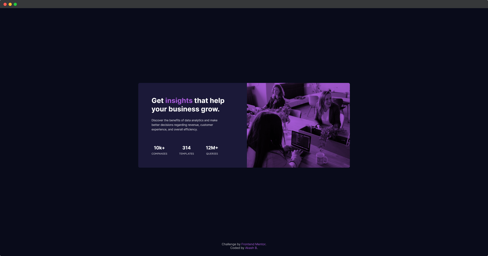
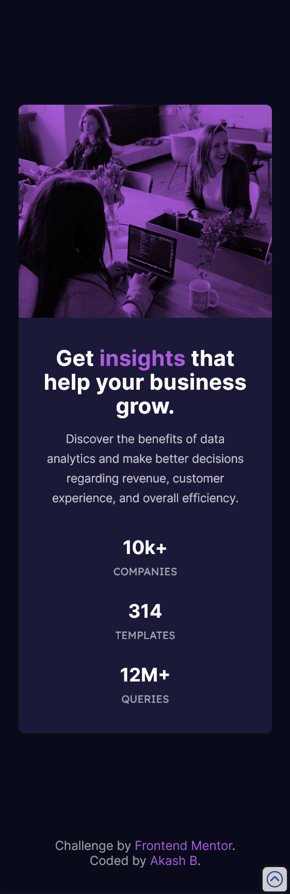

# Stats preview card component solution

This is a solution to the [Stats preview card component challenge on Frontend Mentor](https://www.frontendmentor.io/challenges/stats-preview-card-component-8JqbgoU62).

## Table of contents

- [Stats preview card component solution](#stats-preview-card-component-solution)
  - [Table of contents](#table-of-contents)
    - [The challenge](#the-challenge)
    - [Screenshot](#screenshot)
    - [Links](#links)
  - [My process](#my-process)
    - [Built with](#built-with)
    - [What I learned](#what-i-learned)
  - [Author](#author)


### The challenge

Users should be able to:

- View the optimal layout depending on their device's screen size

### Screenshot

**Desktop View**



**Mobile View**



### Links

- Solution URL: [Add solution URL here](https://your-solution-url.com)
- Live Site URL: [Add live site URL here](https://your-live-site-url.com)

## My process

### Built with

- Semantic HTML5 markup
- CSS custom properties
- Flexbox

### What I learned

The `mix-blend-mode` CSS property sets how an element's content should blend with the content of the element's parent and the element's background.

```css
.image-container {
  background-color: black;
}

img {
  mix-blend-mode: multiply;
}
```

## Author

- Website - [Akash B.](https://akashbanchhor.netlify.app)
- Frontend Mentor - [@akash02ab](https://www.frontendmentor.io/profile/akash02ab)